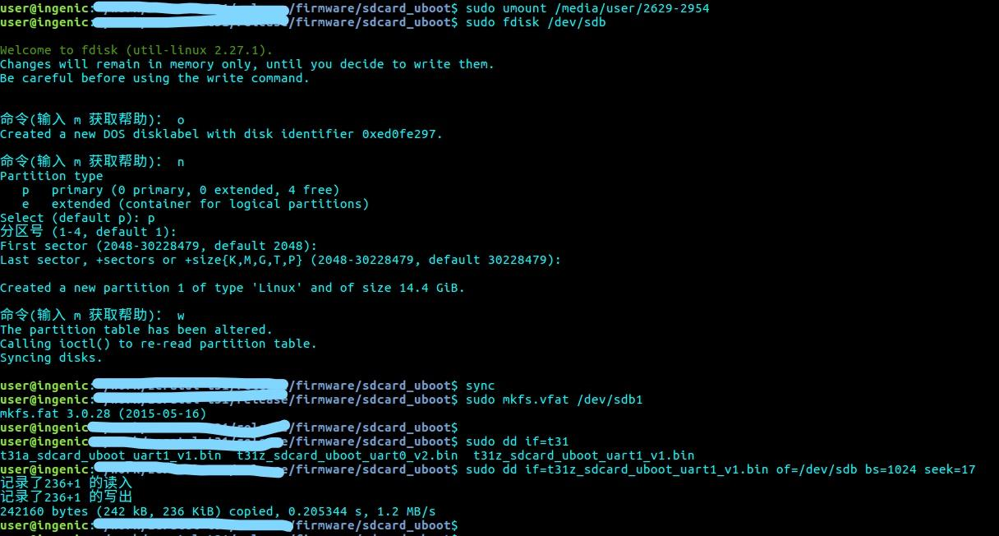

---
sort:2
---

#Software information

When I tired to burn the program into the SD card. I follow the "Burning_method.pdf".  In the 1.1, the step 6 is 

"Compile booting u-boot and burn the u-boot to the SD card's 17 KB offset."

The is uboot file is in the firmware.7z. We need extract it and put the "t40xp_sdcard_uboot_msc0_uart1.bin" in our folder. Than run the command:

```
sudo dd if=t40xp_sdcard_uboot_msc0_uart1.bin of=/dev/sdb bs=1024 seek=17
```

This picture they showed is not accurate .




He tried to write T31 instead T40.